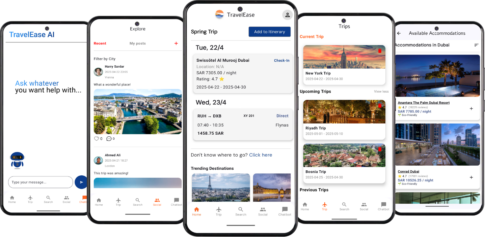

# TravelEase Application 

TravelEase is an Android application for intelligent travel planning using Kotlin and Jetpack Compose.

## Features

- **User Authentication**.
- **Personalized Trip Generation** using a content-based recommender system.
- **Flight, Accommodation, and Activity Search** through real-time APIs.
- **Trip Planning and Management** including itineraries and trip summaries.
- **Expense Tracking** to help users manage their travel budget.
- **Weather Notifications** to help users plan around conditions.
- **Travel Assistant Chatbot** built with a fine-tuned Llama model.
- **Social Platform** for user interactions and sharing experiences.
- **Cloud Database Management** using Firestore.

## Technologies and Tools

- **Firebase** — Used for user authentication and Firestore database management.
- **LLaMA** — A large language model by Meta, fine-tuned to serve as a travel assistant chatbot.
- **Android Studio** — The primary development environment for building the Android application.
- **Render** — Used for cloud deployment of the recommendation system.
- **scikit-learn** — Used for building the content-based recommender system with `TfidfVectorizer` and `cosine_similarity`.
- **SerpApi** — The primary API used for general-purpose search functionality within the application.
- **OpenWeather** — API used to provide weather notifications.

## Related Repositories

- [Recommender System](https://github.com/Rawan-321/recommender_system_dep) — Contains the code for the content-based recommendation system.

## Contributors

This project is the collective work of the TravelEase team: 
- [Rawan Alghamdi](https://github.com/Rawan-321)
- [Ghaida Bakarman](https://github.com/GitGhaida)
- [Noura Alsheddy](https://github.com/NouraAdel)
- [Leen Alshehri](https://github.com/Leeen0)

## Application Main Screens Snapshots

